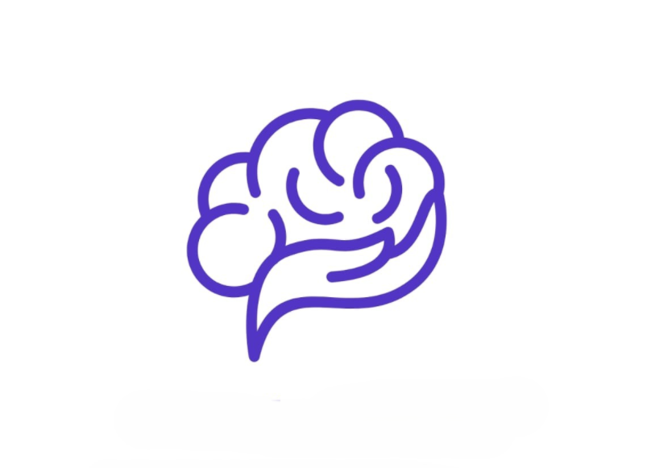
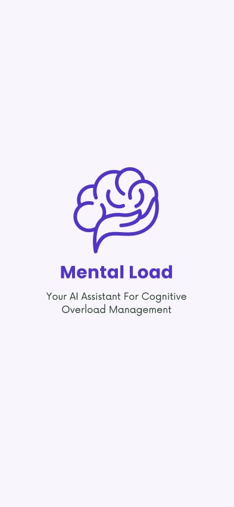
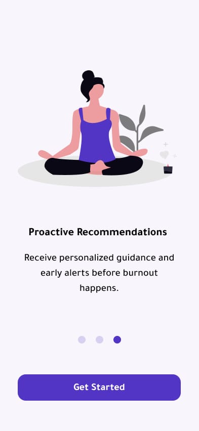
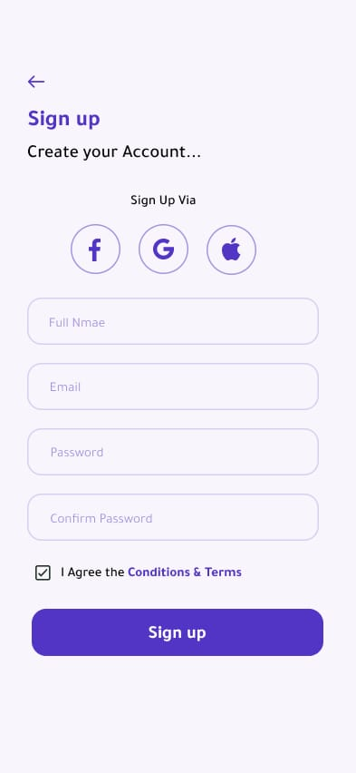
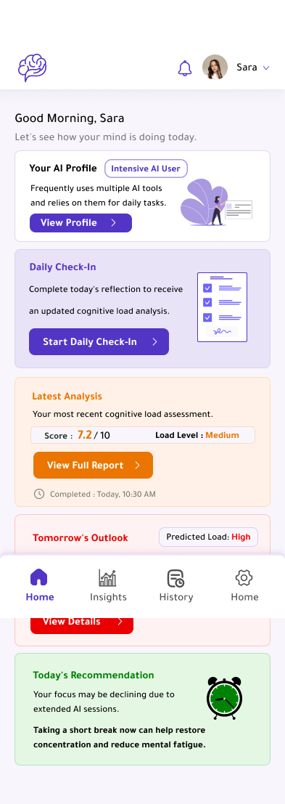
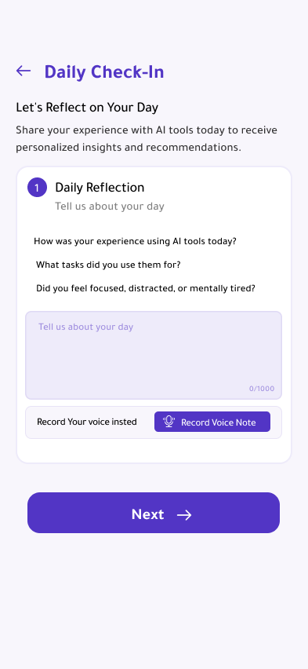
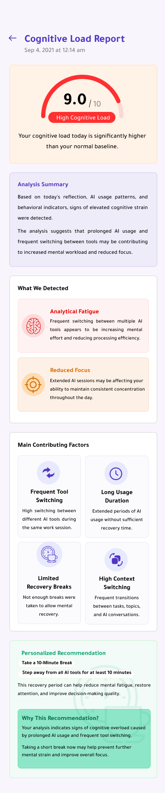
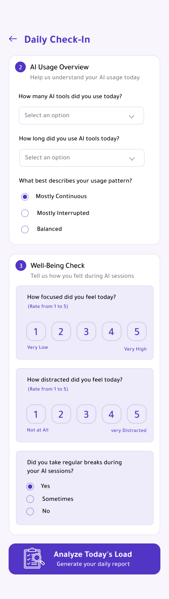
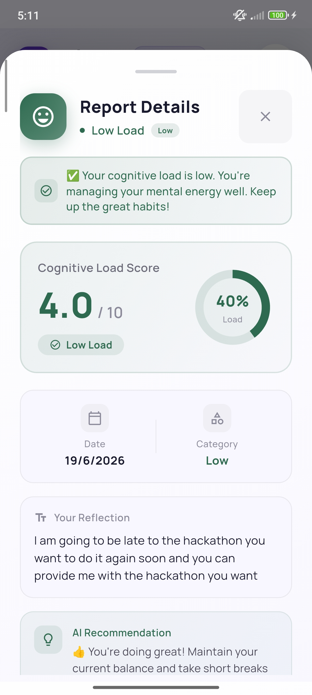
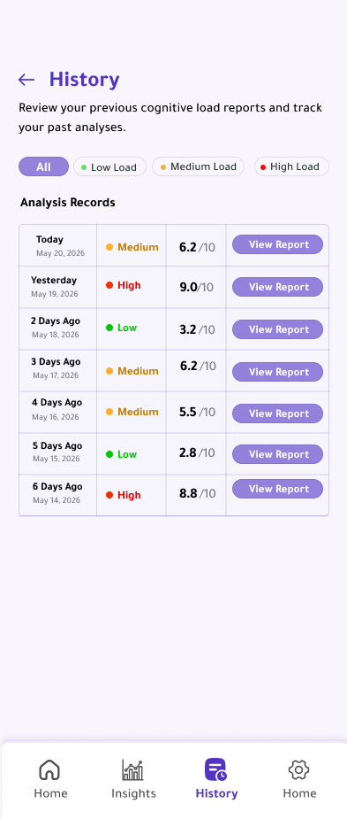

<div align="center">



# 🧠 Mental Load
### Understand Your Mental Load

**AI-Powered Daily Check-in Assistant for Cognitive Overload Detection**


<br/>

[Overview](#-about-the-project) • [Screenshots](#-screenshots) • [Architecture](#-ai-architecture) • [Tech Stack](#️-built-with) • [Getting Started](#-getting-started) • [Team](#-team-goai)

</div>

---

## 📖 About The Project

**Mental Load** is an AI-powered daily check-in assistant that helps heavy AI tool users — ChatGPT, Gemini, Claude, Midjourney, Copilot — detect and manage **cognitive overload** before they ever feel it.

### 🎯 The Problem

> According to a **Harvard Business Review study (March 2026)** of 1,488 full-time employees, **14% of AI tool users suffer from "Brain Fry"** — cognitive fog, difficulty concentrating, and decision-making slowdown caused by intensive AI usage.

Most users don't realize the cause. They keep the same habits, and the overload quietly worsens — until it shows up as missed deadlines, irritability, or burnout.

### 💡 The Solution

<div align="center">

| | Feature | Description | AI Technology |
|:---:|---|---|---|
| 🟢 | **Early Detection** | Analyzes user text to detect cognitive load before the user feels it | `BERT-base-uncased` |
| 🟡 | **Proactive Intervention** | Generates personalized, actionable recommendations | `Gemini 1.5 Flash API` |
| 🔵 | **Future Forecast** | Predicts burnout score 3 days ahead | `ARIMA (statsmodels)` |
| 🟣 | **Recovery Tracker** | Compares scores with/without following recommendations | `Statistical Analysis` |
| 🟠 | **Voice Support** | Voice recording as an alternative to typing | `Whisper API` |
| 🔴 | **Privacy First** | Encrypted data, no third-party sharing, right to be forgotten | `Row Level Security (RLS)` |

</div>

---

## 🎨 Screenshots

> 📌 **For the team:** save each screenshot using the **exact filename** below into the `assets/screenshots/` folder at the project root. Once added, the images below will render automatically — no other changes needed.

```
mental-load/
└── assets/
    └── screenshots/
        ├── splash_screen.png
        ├── onboarding_screen.png
        ├── login_screen.png
        ├── signup_screen.png
        ├── privacy_consent_screen.png
        ├── home_dashboard.png
        ├── checkin_screen.png
        ├── result_screen.png
        ├── patterns_screen.png
        ├── analytics_screen.png
        └── history_screen.png
```

**Recommended specs:** PNG, real device frame removed, portrait `1080×2400` (or your device's native resolution), light mode.

<div align="center">

### 🚀 Onboarding & Auth

<table>
<tr>
<td align="center" width="33%">
<br/>
<b>Splash Screen</b>
</td>
<td align="center" width="33%">
<br/>
<b>Onboarding</b>
</td>
<td align="center" width="33%">
<br/>
<b>Login</b>
</td>
</tr>
</table>

### 📝 Daily Check-in Flow

<table>
<tr>
<td align="center" width="33%">
<br/>
<b>Home Dashboard</b>
</td>
<td align="center" width="33%">
<br/>
<b>Check-in</b>
</td>
<td align="center" width="33%">
<br/>
<b>Result & Score</b>
</td>
</tr>
</table>

### 📊 Insights & Analytics

<table>
<tr>
<td align="center" width="33%">
<br/>
<b>Patterns</b>
</td>
<td align="center" width="33%">
<br/>
<b>Analytics</b>
</td>
<td align="center" width="33%">
<br/>
<b>History</b>
</td>
</tr>
</table>

</div>

---

## 🧠 AI Architecture

<div align="center">

```
┌─────────────────────────────────────────────────────────────────────────┐
│                           USER INTERFACE                                │
│                         (Flutter – Mental Load)                         │
└─────────────────────────────────┬───────────────────────────────────────┘
                                   │
                                   ▼
┌─────────────────────────────────────────────────────────────────────────┐
│                          PROCESSING LAYER                               │
├─────────────────────────────────────────────────────────────────────────┤
│  ┌─────────────────┐    ┌──────────────────┐    ┌──────────────────────┐│
│  │   Whisper API    │──▶│       BERT        │──▶│     Gemini API       ││
│  │  (Voice → Text)  │   │  (Text → Score)   │   │   (Score → Advice)   ││
│  └─────────────────┘    └──────────────────┘    └──────────────────────┘│
└─────────────────────────────────┬───────────────────────────────────────┘
                                   │
                                   ▼
┌─────────────────────────────────────────────────────────────────────────┐
│                    DATABASE (Supabase – PostgreSQL)                     │
│                   • Users  • Check-ins  • Recommendations               │
└─────────────────────────────────────────────────────────────────────────┘
```

</div>

### AI Pipeline (for Devpost)

```
INPUTS  →  Free text + (optional) voice + AI tools count + usage pattern
   │
   ├─▶  Whisper API            (voice → text)
   │
   ├─▶  BERT-base-uncased      (text → Cognitive Load Score 1–5 + confidence %)
   │
   ├─▶  Gemini 1.5 Flash       (score + history → personalized recommendation)
   │
   └─▶  OUTPUT  →  Score (1–5) + Recommendation Text + 3-Day Forecast
```

---

## 🛠️ Built With

<div align="center">

| Layer | Technology | Purpose |
|---|---|---|
| 🎨 **Frontend** | Flutter | Cross-platform UI (Android, iOS, Web) |
| 🖌️ **UI Design** | Glassmorphism, Google Fonts | Calm, focused visual language |
| 🗄️ **Backend & Database** | Supabase (PostgreSQL) | Authentication, real-time sync |
| 🧩 **NLP Classification** | BERT-base-uncased (Hugging Face) | Cognitive Load Score (1–5) |
| 💬 **Recommendations** | Google Gemini 1.5 Flash API | Personalized recommendations |
| 🎙️ **Speech-to-Text** | OpenAI Whisper API | Voice recording → text |
| 📈 **Forecasting** | ARIMA (statsmodels) | 3-day burnout forecast |
| 📊 **Charts** | fl_chart | Analytics dashboard |

</div>

---

## 🏆 USAII Global AI Hackathon 2026

<div align="center">

| Category | Details |
|---|---|
| **Track** | Undergraduate |
| **Challenge** | Productivity — *"Second Brain for Real Life"* |
| **Team Name** | **GOAI** |
| **Hackathon Dates** | June 14 – 21, 2026 |

</div>

---

## 🛡️ Responsible AI & Guardrails

| Risk | Mitigation |
|---|---|
| **Replacing professional care** | Clear disclaimer + professional helplines for high scores |
| **Data privacy** | End-to-end encryption (TLS 1.3 + AES-256) + no third-party sharing |
| **Underage users** | Parental consent + weekly reports to parents |
| **Model bias** | Manual user corrections + multi-language models planned |

## 👥 Human-in-the-Loop Design

| Layer | Description |
|---|---|
| **Correction** | User can correct the score if the AI was inaccurate |
| **Follow-up** | Next day: *"Did you follow the recommendation?"* |
| **Consent** | Professional help requires an explicit button click |
| **Parental** | Users under 18 require parent consent |

---

## 📁 Project Structure

```
mental-load/
├── lib/
│   ├── main.dart
│   ├── screens/              # 13 screens
│   │   ├── splash_screen.dart
│   │   ├── onboarding_screen.dart
│   │   ├── login_screen.dart
│   │   ├── signup_screen.dart
│   │   ├── privacy_consent_screen.dart
│   │   ├── initial_questionnaire.dart
│   │   ├── home_dashboard.dart
│   │   ├── checkin_screen.dart
│   │   ├── result_screen.dart
│   │   ├── patterns_screen.dart
│   │   ├── analytics_screen.dart
│   │   ├── history_screen.dart
│   │   └── settings_screen.dart
│   ├── widgets/               # Reusable components
│   ├── services/              # Supabase, AI, Audio services
│   ├── models/                # Data models
│   └── utils/                 # Constants, helpers, theme
├── assets/
│   ├── icons/                 # App icons
│   ├── fonts/                 # Tajawal, Inter fonts
│   ├── screenshots/           # 📸 README screenshots (see above)
│   └── images/                # App images
├── SQL/                       # Database schema & RLS policies
├── android/                   # Android-specific files
├── ios/                       # iOS-specific files
├── web/                       # Web-specific files
├── pubspec.yaml                # Dependencies
└── README.md                   # This file
```

---

## 🚀 Getting Started

### Prerequisites

| Requirement | Version |
|---|---|
| Flutter SDK | 3.19+ |
| Dart SDK | 3.3+ |
| Android Studio / VS Code | Latest |
| Supabase Account | Free |
| Google AI Studio Account | Free |

### Installation

```bash
# 1. Clone the repository
git clone https://github.com/Alhayek7/mental-load.git
cd mental-load

# 2. Install dependencies
flutter pub get

# 3. Set up environment variables
cp .env.example .env
```

Then fill in your `.env`:

```env
SUPABASE_URL=your_supabase_url
SUPABASE_ANON_KEY=your_supabase_anon_key
GEMINI_API_KEY=your_gemini_api_key
OPENAI_API_KEY=your_openai_api_key
```

```bash
# 4. Run the app
flutter run
```

---

## 📅 Development Timeline (7 Days)

| Day | Tasks | Lead |
|---|---|---|
| **Day 1** | Project setup, Supabase, Auth screens | Wesam + Ahmed |
| **Day 2** | Dashboard, Check-in screen, Database integration | Wesam + Ratul |
| **Day 3** | BERT integration + Gemini API | Ahmed + Ratul |
| **Day 4** | Human-in-the-Loop + Guardrails | Ayat + Raghad |
| **Day 5** | Forecast (ARIMA) + Analytics | Ratul + Ayat |
| **Day 6** | UI improvements + Testing | Raghad + Team |
| **Day 7** | Video recording + Devpost submission | Entire Team |

---

## 👥 Team GOAI

<div align="center">

| Name | Role | Contact |
|---|---|---|
| **Ahmed Eid Abo Baid** | AI Engineer | eidez1252002@gmail.com |
| **Ayat Zaky Shehada Hamed** | Software Engineer | ayat.zaky.hamed@gmail.com |
| **Ratul Hasan Ruhan** | Machine Learning Engineer | ratulhasan1644@gmail.com |
| **Ahmed Wesam Alhayek** | Software Developer | aalhayek7@smail.ucas.edu.ps |
| **Raghad Mohammad Jawad AlSerhy** | AI Engineer | raghadmohammad804@gmail.com |

</div>

---

## 📄 License

Distributed under the **MIT License**. See [LICENSE](LICENSE) for details.

## 🙏 Acknowledgments

- **USAII** — for organizing the Global AI Hackathon 2026
- **Harvard Business Review** — for the *"When AI Overloads Your Brain"* study (March 2026)
- **Hugging Face** — for BERT models
- **Google** — for the Gemini API
- **OpenAI** — for the Whisper API
- **Supabase** — for backend infrastructure
- **Flutter** — for the amazing framework

---

<div align="center">

**🔗 Repository:** [github.com/Alhayek7/mental-load](https://github.com/Alhayek7/mental-load) &nbsp;|&nbsp; **🔒 Privacy Policy:** [PRIVACY.md](PRIVACY.md)

Built with ❤️ for the USAII Global AI Hackathon 2026

⭐ **Star this repository if you like the project!**

© 2026 Team GOAI

</div>
