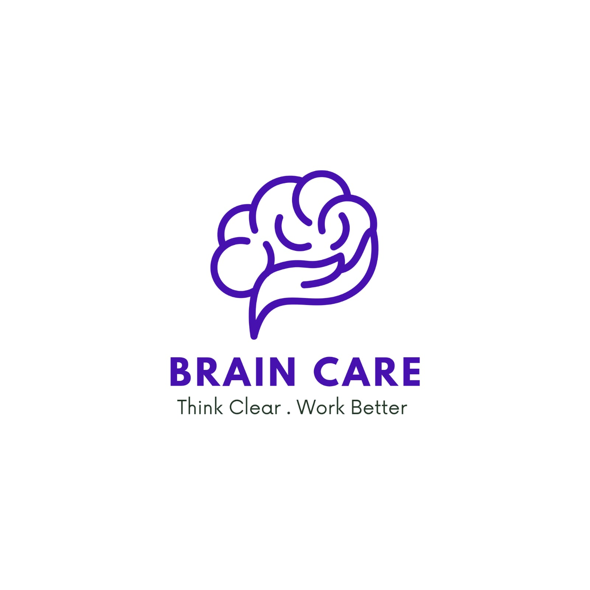

<div align="center">
  
  <h1>🧠 Mental Load</h1>
  <p><strong>Understand Your Mental Load</strong></p>
  <p>AI-Powered Daily Check-in Assistant for Cognitive Overload Detection</p>
  
  <!-- Shields.io Badges -->
  <a href="#"></a>
  <a href="#"></a>
  <a href="#"></a>
  <a href="#"></a>
  <a href="#"></a>
  <a href="#"></a>
</div>

---

## 📖 About The Project

**Mental Load** is an AI-powered daily check-in assistant that helps heavy AI tool users (ChatGPT, Gemini, Claude, Midjourney, Copilot) detect and manage **cognitive overload** before they feel it.

### 🎯 The Problem

According to a **Harvard Business Review study (March 2026)** of 1,488 full-time employees:

> **14% of AI tool users suffer from "Brain Fry"** – cognitive fog, difficulty concentrating, and decision-making slowdown caused by intensive AI usage.

**Most users don't realize the cause**, so they continue the same behavior and the overload worsens.

### 💡 The Solution

| Feature | Description | AI Technology |
| :--- | :--- | :--- |
| 🟢 **Early Detection** | Analyzes user text to detect cognitive load before user feels it | BERT-base-uncased |
| 🟡 **Proactive Intervention** | Generates personalized recommendations | Gemini 1.5 Flash API |
| 🔵 **Future Forecast** | Predicts burnout score 3 days ahead | ARIMA (statsmodels) |
| 🟣 **Recovery Tracker** | Compares scores with/without following recommendations | Statistical Analysis |
| 🟠 **Voice Support** | Voice recording alternative to typing | Whisper API |
| 🔴 **Privacy First** | Encrypted data, no third-party sharing, right to be forgotten | Row Level Security (RLS) |

---

## 🏆 USAII Global AI Hackathon 2026

This project is submitted to the **USAII Global AI Hackathon 2026** in the **Undergraduate Track**.

| Category | Details |
| :--- | :--- |
| **Track** | Undergraduate |
| **Challenge** | Productivity: "Second Brain for Real Life" |
| **Team Name** | **GOAI** |
| **Hackathon Dates** | June 14 – 21, 2026 |

---

## 👥 Team GOAI

| Name | Role | Email |
| :--- | :--- | :--- |
| **Ahmed Eid Abo Baid** | AI Engineer | eidez1252002@gmail.com |
| **Ayat Zaky Shehada Hamed** | Data Scientist | ayat.zaky.hamed@gmail.com |
| **Ratul Hasan Ruhan** | Machine Learning Engineer | ratulhasan1644@gmail.com |
| **Ahmed Wesam Alhayek** | Software Developer | aalhayek7@smail.ucas.edu.ps |
| **Raghad Mohammad Jawad AlSerhy** | UI/UX Designer | raghadmohammad804@gmail.com |

---

## 🛠️ Built With

| Layer | Technology | Purpose |
| :--- | :--- | :--- |
| **Frontend** | Flutter | Cross-platform UI (Android, iOS, Web) |
| **UI Design** | Glassmorphism, Google Fonts | Glassmorphism & Calm UI |
| **Backend & Database** | Supabase (PostgreSQL) | Authentication, Real-time sync |
| **NLP Classification** | BERT-base-uncased (Hugging Face) | Cognitive Load Score (1-5) |
| **Recommendations** | Google Gemini 1.5 Flash API | Personalized recommendations |
| **Speech-to-Text** | OpenAI Whisper API | Voice recording → text |
| **Forecasting** | ARIMA (statsmodels) | 3-day burnout forecast |
| **Charts** | fl_chart | Analytics dashboard |

---

## 🧠 AI Architecture

```
┌─────────────────────────────────────────────────────────────────────────┐
│                           USER INTERFACE                                │
│                         (Flutter - Mental Load)                         │
└─────────────────────────────────┬───────────────────────────────────────┘
                                  │
                                  ▼
┌─────────────────────────────────────────────────────────────────────────┐
│                         PROCESSING LAYER                                │
├─────────────────────────────────────────────────────────────────────────┤
│                                                                         │
│  ┌─────────────────┐    ┌─────────────────┐    ┌─────────────────────┐ │
│  │  Whisper API    │───▶│      BERT       │───▶│   Gemini API        │ │
│  │  (Voice → Text) │    │  (Text → Score) │    │  (Score → Advice)   │ │
│  └─────────────────┘    └─────────────────┘    └─────────────────────┘ │
│                                                                         │
└─────────────────────────────────┬───────────────────────────────────────┘
                                  │
                                  ▼
┌─────────────────────────────────────────────────────────────────────────┐
│                    DATABASE (Supabase - PostgreSQL)                     │
│                   • Users • Check-ins • Recommendations                 │
└─────────────────────────────────────────────────────────────────────────┘
```

### AI Pipeline (for Devpost)

```
INPUTS: Free text + (optional) voice + AI tools count + usage pattern
                ↓
        Whisper API (voice → text)
                ↓
    BERT-base-uncased → Cognitive Load Score (1-5) + Confidence (%)
                ↓
    Gemini 1.5 Flash → Personalized Recommendations
                ↓
    OUTPUT: Score (1-5) + Recommendation Text + 3-Day Forecast
```

---

## 🛡️ Responsible AI & Guardrails

| Risk | Mitigation |
| :--- | :--- |
| **Replacing professional care** | Clear disclaimer + professional helplines for high scores |
| **Data privacy** | End-to-end encryption (TLS 1.3 + AES-256) + no third-party sharing |
| **Underage users** | Parental consent + weekly reports to parents |
| **Model bias** | Manual user corrections + multi-language models planned |

---

## 👥 Human-in-the-Loop Design

| Layer | Description |
| :--- | :--- |
| **Correction** | User can correct Score if AI was inaccurate |
| **Follow-up** | Next day: "Did you follow the recommendation?" |
| **Consent** | Professional help requires explicit button click |
| **Parental** | Users under 18 require parent consent |

---

## 🎨 Screenshots

*(Add your screenshots here after building the app)*

| Splash Screen | Dashboard | Check-in | Results | Patterns |
| :---: | :---: | :---: | :---: | :---: |
| 🚀 | 📊 | ✍️ | 📈 | 📉 |

---

## 📁 Project Structure

```
mental-load/
├── lib/
│   ├── main.dart
│   ├── screens/          # 13 screens
│   │   ├── splash_screen.dart
│   │   ├── onboarding_screen.dart
│   │   ├── login_screen.dart
│   │   ├── signup_screen.dart
│   │   ├── privacy_consent_screen.dart
│   │   ├── initial_questionnaire.dart
│   │   ├── home_dashboard.dart
│   │   ├── checkin_screen.dart
│   │   ├── result_screen.dart
│   │   ├── patterns_screen.dart
│   │   ├── analytics_screen.dart
│   │   ├── history_screen.dart
│   │   └── settings_screen.dart
│   ├── widgets/          # Reusable components
│   ├── services/         # Supabase, AI, Audio services
│   ├── models/           # Data models
│   └── utils/            # Constants, helpers, theme
├── assets/
│   ├── icons/            # App icons
│   ├── fonts/            # Tajawal, Inter fonts
│   └── images/           # App images
├── android/              # Android-specific files
├── ios/                  # iOS-specific files
├── web/                  # Web-specific files
├── pubspec.yaml          # Dependencies
└── README.md             # This file
```

---

## 🚀 Getting Started

### Prerequisites

| Requirement | Version |
| :--- | :--- |
| Flutter SDK | 3.19+ |
| Dart SDK | 3.3+ |
| Android Studio / VS Code | Latest |
| Supabase Account | Free |
| Google AI Studio Account | Free |

### Installation

1. **Clone the repository**
```bash
git clone https://github.com/your-username/mental-load.git
cd mental-load
```

2. **Install dependencies**
```bash
flutter pub get
```

3. **Set up environment variables**
   - Copy `.env.example` to `.env`
   - Add your Supabase and API keys

```env
SUPABASE_URL=your_supabase_url
SUPABASE_ANON_KEY=your_supabase_anon_key
GEMINI_API_KEY=your_gemini_api_key
OPENAI_API_KEY=your_openai_api_key
```

4. **Run the app**
```bash
flutter run
```

---

## 📅 Development Timeline (7 Days)

| Day | Tasks | Lead |
| :--- | :--- | :--- |
| **Day 1** | Project setup, Supabase, Auth screens | Wesam + Ahmed |
| **Day 2** | Dashboard, Check-in screen, Database integration | Wesam + Ratul |
| **Day 3** | BERT integration + Gemini API | Ahmed + Ratul |
| **Day 4** | Human-in-the-Loop + Guardrails | Ayat + Raghad |
| **Day 5** | Forecast (ARIMA) + Analytics | Ratul + Ayat |
| **Day 6** | UI improvements + Testing | Raghad + Team |
| **Day 7** | Video recording + Devpost submission | Entire Team |

---

## 📄 License

Distributed under the **MIT License**.

---

## 🙏 Acknowledgments

- **USAII** – For organizing the Global AI Hackathon 2026
- **Harvard Business Review** – For the "When AI Overloads Your Brain" study (March 2026)
- **Hugging Face** – For BERT models
- **Google** – For Gemini API
- **OpenAI** – For Whisper API
- **Supabase** – For backend infrastructure
- **Flutter** – For the amazing framework

---

## 📧 Contact

| Name | Role | Email |
| :--- | :--- | :--- |
| Ahmed Eid Abo Baid | AI Engineer | eidez1252002@gmail.com |
| Ayat Zaky Shehada Hamed | Data Scientist | ayat.zaky.hamed@gmail.com |
| Ratul Hasan Ruhan | ML Engineer | ratulhasan1644@gmail.com |
| Ahmed Wesam Alhayek | Software Developer | aalhayek7@smail.ucas.edu.ps |
| Raghad Mohammad Jawad AlSerhy | UI/UX Designer | raghadmohammad804@gmail.com |

**GitHub Repository:** [https://github.com/Alhayek7/mental-load](https://github.com/Alhayek7/mental-load)  
**Privacy Policy:** [PRIVACY_POLICY.md](https://github.com/Alhayek7/mental-load/blob/main/PRIVACY_POLICY.md)
---

<div align="center">
  <hr/>
  <p>Built with ❤️ for the USAII Global AI Hackathon 2026</p>
  <p>⭐ Star this repository if you like the project!</p>
  <p>© 2026 Team GOAI</p>
</div>

